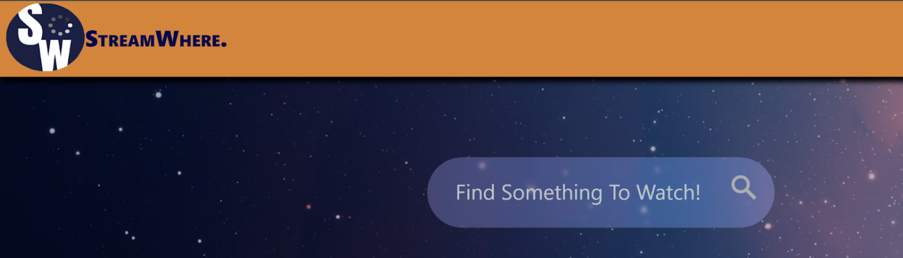
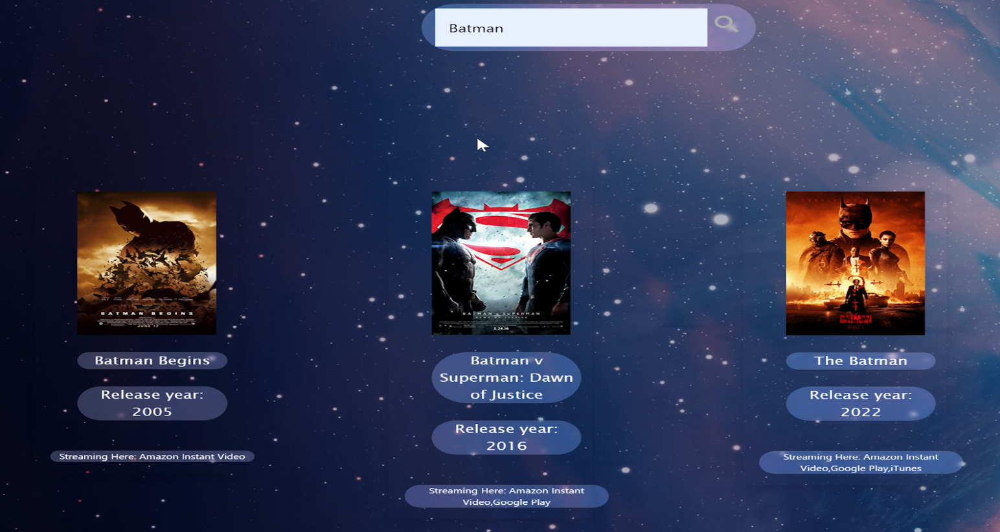
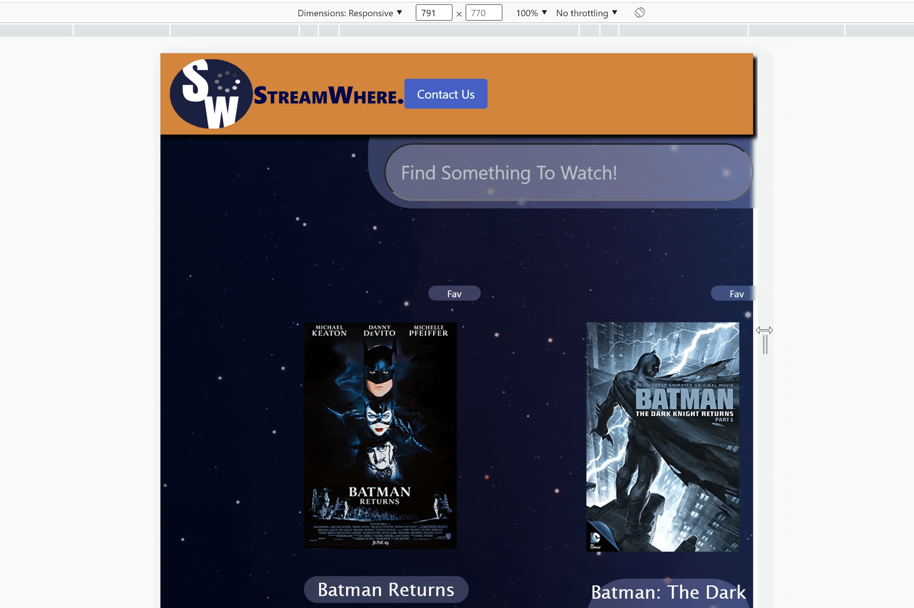

# StreamWhere?


## Table of Contents


- [Description](#description)
- [Technologies](#technologies)
- [Deployed Link](#link)
- [Usage](#usage)
- [User Information](#userinformation)
- [Credits](#credits)
- [License](#license)

## Description
StreamWhere is a simple search-engine that allows users to search for their favorite movies and tvshows inorder to find out through which services they can be streamed.  

## Technologies Used

- HTML
- CSS
- Bootstrap
- Javascript
- jQuery
- [Bulma](https://bulma.io/documentation/)
- [Utelly API](https://rapidapi.com/utelly/api/utelly/)
- [Movie Database Alternative API](https://rapidapi.com/rapidapi/api/movie-database-alternative/)


## Deployed Link

[Visit StreamWhere!](https://mtwence.github.io/stream-where/)

## Usage

### Website Demo


<br>

### User Story
As a USER, I want to be able to search for a specific movie or TV title <br>
THEN I am presented with a search bar



As a USER, I want all relevant titles displayed based on my search <br>
THEN the results are displayed with Title, Year of Release, and Places to Watch



As a USER, I want to be able to access the site I can view the media <br>
THEN I am given links to all available services with the desired media <br>
(This feature got pushed to the next sprint cycle)


### Media Query
Media query set in css to shift cards from two columns to one at 768px.



### Code Snippets
This function initiates upon and triggers both our API fetch requests. Nested within the event listener is logic to turn a multi-word search into one that will be callable to the Movie Database API by replacing the empty spaces between words with "%20".
```ruby
form.on("submit", function (x) {
    x.preventDefault();
	var search = input.val();
	var rep = / /gi;
	var movieInput = search.replace(rep, "%20");
	console.log(movieInput)
```

This is the first fetch request we initiate which calls upon the Movie Database Alternative. From the JSON response object we parse the movie title, poster, and year of release and append that to the page. The last response item we get is the IMDBid which is a unique id for movies/media. These ids that are returned from the text string search are then used at the inputs into our next fetch request. 
```ruby
const options = {
		method: 'GET',
		headers: {
			'X-RapidAPI-Key': 'a341e5528dmshfb626c60584810dp17d30ejsnb83576f61579',
			'X-RapidAPI-Host': 'movie-database-alternative.p.rapidapi.com'
		}
	};

	fetch('https://movie-database-alternative.p.rapidapi.com/?s=' + movieInput + '&r=json&page=1', options)
		.then(function (response) {
			return response.json();
		}).then(function (data) {
			var IDstorage = []; // Array for storing IDs
			for (var i = 0; i < data.Search.length - 1; i++) {
				//Image link to the poster
				var poster = data.Search[i].Poster;
				var imageDisplay = document.getElementById(i+1).children[1].children[0].children[0].children[0].children[0];
				imageDisplay.setAttribute("src", poster);
				//Movie title
				var title = data.Search[i].Title;
				var titleDisplay = document.getElementById(i + 1).children[1].children[0].children[1].children[1];
				titleDisplay.textContent = title;
				//Release year
				var year = data.Search[i].Year;
				var yearDisplay = document.getElementById(i + 1).children[1].children[0].children[1].children[3];
				yearDisplay.textContent = "Release Year: " + year;
				//Critical imdbID
				var imdbID = data.Search[i].imdbID;
				IDstorage.push(imdbID);
			}
```

This is the fetch call to our second server-side API - Utelly. Using the array of IMDBids that we collected from our first request, we input each of those into our fetch request using a for loop. After getting a JSON response we paruse another for loop to parse list of available streaming services, the icons for those services, and links to watch. Finally we have another for loop to iterate through this data and append it to the page. 

```ruby
const options1 = {
				method: 'GET',
				headers: {
					'X-RapidAPI-Key': 'a341e5528dmshfb626c60584810dp17d30ejsnb83576f61579',
					'X-RapidAPI-Host': 'utelly-tv-shows-and-movies-availability-v1.p.rapidapi.com'
				}
			};
		for (var j = 0; j < IDstorage.length; j++) {
				fetch('https://utelly-tv-shows-and-movies-availability-v1.p.rapidapi.com/idlookup?source_id=' + IDstorage[j] + '&source=imdb&country=us', options1)
					.then(function (res) {
						return res.json();
					}).then(function (data) {
						console.log(data);
						var streamStorage = [];
						var streamLength = data.collection.locations.length
						console.log(streamLength)
						// for loop to gather streaming platform name, icon, and link to watch/buy 
						for (var i = 0; i < streamLength; i++) {
							var streamName = data.collection.locations[i].display_name;
							streamStorage.push(streamName)
							console.log(streamStorage)
								
							for (var k = 0; k < streamStorage.length; k++) {
								var streamDisplay = document.getElementById(i + 1).children[1].children[1];
									streamDisplay.textContent = "Streaming Here: " + streamStorage;
									var icon = data.collection.locations[i].icon
									var link = data.collection.locations[i].url;
```
## Learning Objectives
Through this process we set-out to learn about integrating APIs into an original design of our own. Through this we wanted to improve our skills and knowledge in leveraging javascript libraries, and bootstrap alternatives to build a user-friendly and responsive site. Besides just the development of some web app, it was important for us to craft our team-working and communication skills. The whole project was certainly an informative experiences for all of us, in many ways. 

## User Information

### **Michael Wence**
[LinkdIn](https://www.linkedin.com/in/michael-wence/) |
[GitHub](https://github.com/mtwence)

### **Daniel Stefani**
[LinkdIn](https://www.linkedin.com/in/daniel-stefani-b88695238/)
[GitHub](https://github.com/DStefani86)

### **Clement Koo**
[LinkdIn](https://www.linkedin.com/in/clement-t-k-459322138/)
[GitHub](https://github.com/C-K999)
## Credits

UCB - Coding Bootcamp


## License

[](https://opensource.org/licenses/MIT)

---

© 2022 Michael Wence. All Rights Reserved.